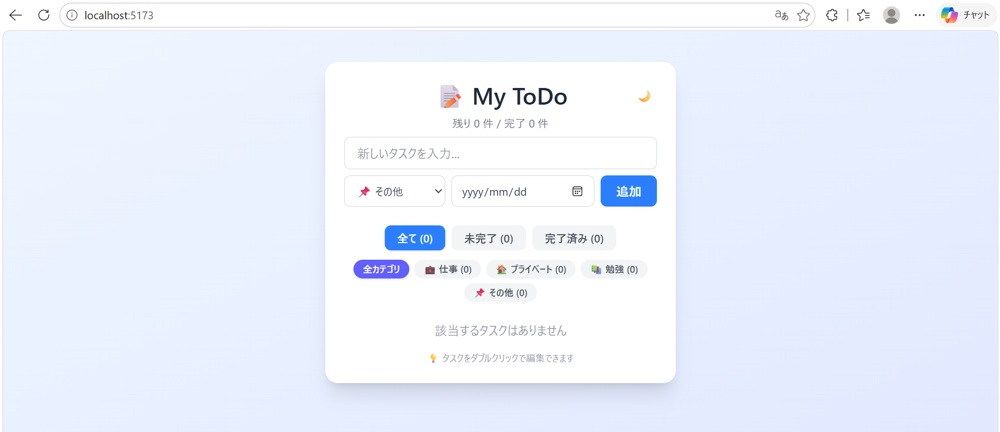

# My ToDo - React + TypeScript で作ったタスク管理アプリ

シンプルながら実用的な機能を備えたToDoアプリです。  
React、TypeScript、Tailwind CSSを使った実用的なアプリを目指しました。

## スクリーンショット
　　

## 主な機能

・タスクのCRUD操作（作成・編集・削除・完了切り替え）
・締切日の設定と、期限切れ・当日・直近のステータス表示
・カテゴリ分類（仕事・プライベート・勉強・その他）
・完了状態 × カテゴリの複合フィルター
・ダークモード（OS設定追従＋手動切り替え）
・localStorageによるデータ永続化
・ダブルクリックで編集モード（テキスト・締切・カテゴリすべて変更可能）
・キーボード操作対応（Enter保存 / Esc キャンセル）

## 使用技術

| カテゴリ | 技術 |
| --- | --- |
| 言語 | TypeScript |
| フレームワーク | React 19 |
| ビルドツール | Vite |
| スタイリング | Tailwind CSS v4 |
| データ永続化 | localStorage |
| デプロイ | Vercel |

## 工夫した点

### 1. 型安全な設計

TypeScriptのユニオン型（`'all' | 'active' | 'completed'`）とRecord型を活用し、不正な値が入らない設計にしました。カテゴリ設定を1箇所のオブジェクトに集約することで、新しいカテゴリの追加が1行で済む保守性の高い構造にしています。

### 2. データのマイグレーション処理

localStorageから読み込む際、古いバージョンで作成されたデータに新フィールド（カテゴリ）がなくても自動で補完されるようにし、後方互換性を保っています。

### 3. ユーザー体験への配慮

・編集モードに入った瞬間に入力欄へ自動フォーカス＆全選択
・Enter / Esc / ボタン と複数の確定方法を提供
・締切が近い順に自動ソート
・期限切れタスクがある場合は画面上部にアラート表示
・OS設定がダークモードなら初回起動時もダークモード

### 4. 状態管理の使い分け

・`useState` でアプリの状態（タスク・フィルター・編集状態など）を管理
・`useEffect` で localStorage への自動保存とダークモード切り替えを実装
・`useRef` で編集入力欄への直接アクセス（フォーカス制御）

## アプリ起動準備
アプリを起動するには、PCに以下のものをダウンロードする必要があります。
・Node.js（v18以上）：https://nodejs.org/
・Git：https://git-scm.com/
・テキストエディタ（VS Code推奨）

## ローカルでの起動方法

```bash
git clone https://github.com/h22s5079/todo-app.git
cd todo-app
npm install
npm run dev
